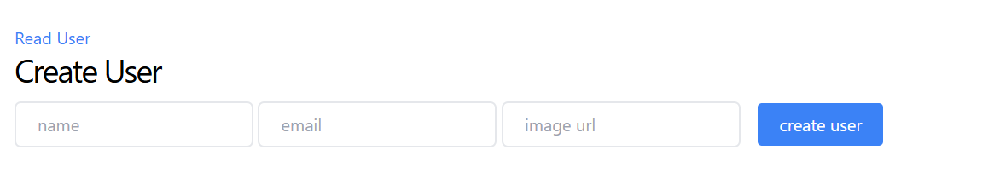

# 🧑‍💻 User CRUD App using Node.js, Express, EJS & MongoDB

A simple web application that performs **CRUD operations** (Create, Read, Update, Delete) on user data using **MongoDB and Mongoose**. It also uses **EJS** as a template engine for rendering dynamic HTML.

 

## 🔥 Preview

> Replace the image path above with your actual screenshot or demo gif location.

---

## 📁 Features

- Add new users with name, email, and image URL
- View a list of all users
- Edit user information
- Delete users
- EJS templating for frontend views
- MongoDB database connection using Mongoose

---

## 🚀 Technologies Used

- Node.js
- Express.js
- MongoDB + Mongoose
- Tailwind CSS
- EJS (Embedded JavaScript Templates)
- HTML/CSS (served from `public/` folder)

---
## ⚙️ Install Dependencies
Run the following command in your project directory:

npm install express mongoose ejs body-parser cookie-parser method-override

